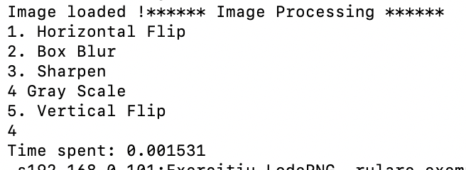

# Procesor Performant de Imagini

## Proiect Sisteme cu Microprocesoare

### Student: Moiceanu Andrei
### Grupa: 333AA

1) Descrierea Temei

Proiectul are ca scop realizarea unui procesor de imagini performant folosind biblioteca LodePNG si algoritmi de prelucrare a imagini pentru a realiza o aplicatie de procesare a imaginilor

2) Surse si imbunatatiri aduse

Proiectul se bazeaza in jurul utilitarei LodePNG, biblioteca folosita pentru citirea si scrierea imaginilor PDF.
Acesta se bazeaza pe laboratorul nr 6. Plecand de la acel cod de baza, s-a facut o aplicatie completa de procesare de imagini avand mai multe procese precum diverse convolutii, rotiri si schimbari de spatii de culoare.
Aplicatia a fost gandita cu utilizarea alocarii dinamice. Utilizarea alocarii dinamice asigura ca memoria nu este umpluta degeaba si aduce un plus de performanta.

Imbunatatiri aduse prin implementarea in limbaj de asamblare:
 * Functiile Vertial Flip si Horizontal Flip: A fost optimizat calculul de adresa, facandu-se de 2 ori/iteratie fata de 12 ori in implementarea din C

3) Descrierea aplicatiei

Aplicatia este un procesor de imagini. Pentru a avea performanta inalta aplicatia este scrisa in C. Pentru un consum eficient de memorie, aplicatia a fost gandita cu alocare dinamica.
Algoritmii de baza folositi sunt
 a. Conversia RGBA-GRAY
 b. Convolutia bidimensionala(Blur si Sharpen)
 c. Rotatii in jurul axelor
 
Pentru fiecare procesare, timpul de executia este monitorizat. Astfel pe un Macbook Pro cu procesor Intel i7(Gen 2017) 2.8 Ghz am obtinut urmatorii timpi de executie pe o imagine 512x512:
 a. Horizontal Flip: 0.001s
 b. Vertical Flip: 0.0014s
 c. Blur: 0.0091s 
 d. Sharpen: 0.02s
 e. To Gray: 0.0015s
4) Compilare

Pentru compilare este necesar un compilator de C (gcc - Linux/ clang - OS X/ MinGW - Windows)
In proiect se gaseste un makefile, pentru a realiza compilarea se executa in linia de comanda
```
make c
```
5) Utilizare


 I. Utilizatorul lanseaza aplicatia din linia de comanda in unul dintre cele 2 feluri:
* ./image_processor <- va lua automat imaginea doar daca exista test.png
* ./image_processor source_img.png

 II. Din meniu va alege una din procesarile pe care sa le aplice:
 * Blur
 * Sharpen
 * Vertical Flip
 * Horizontal Flip
 * To Gray

III. Imaginea procesata se gaseste in acelasi director cu numele output.png
6) Referinte

 * Biblioteca pentru citirea/scriere imagini PNG https://lodev.org/lodepng/
 * Operatia de convolutia 2D https://www.allaboutcircuits.com/technical-articles/two-dimensional-convolution-in-image-processing/


